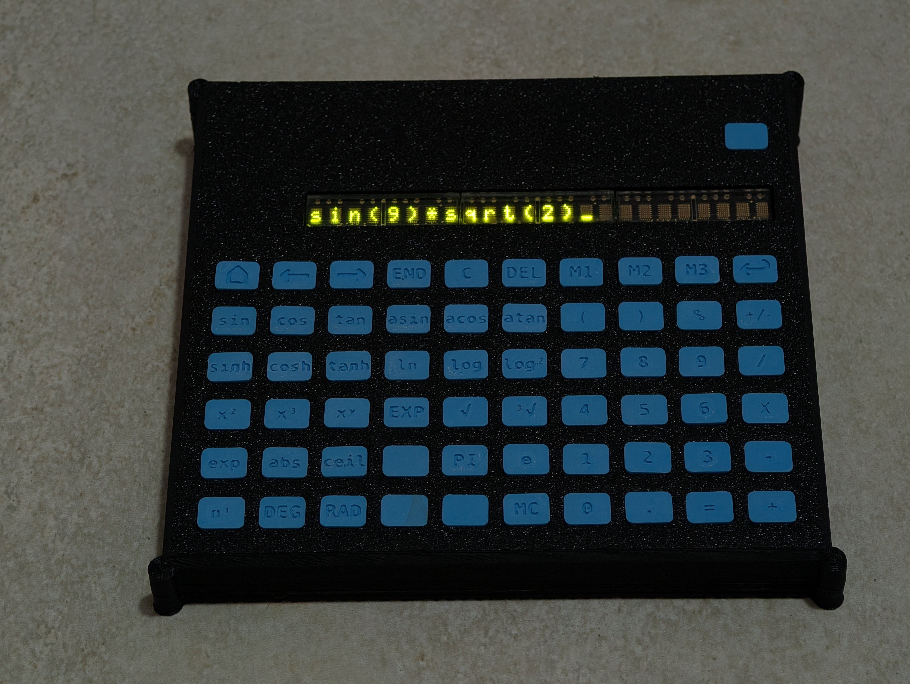
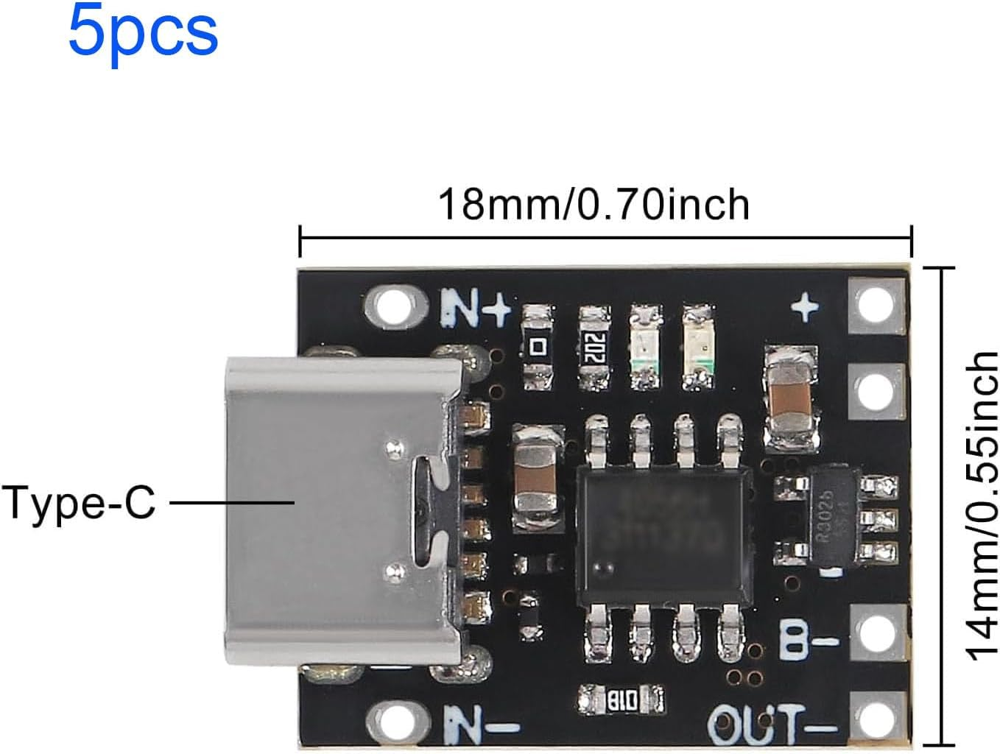
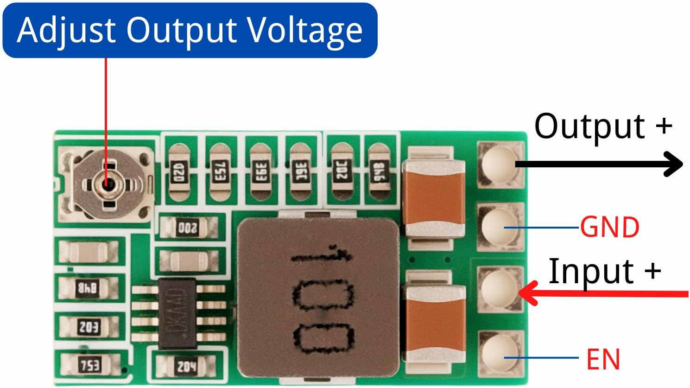
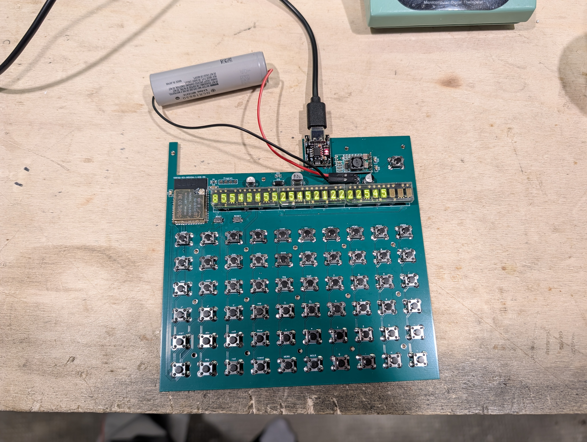

# HCMS Scientific Calculator

A handmade scientific calculator built with an ESP32-S3 microcontroller, Broadcom HCMS-2913 LED dot-matrix displays, and a custom 6×10 matrix keypad — all running on [ESPHome](https://esphome.io/).

---

## Features

- 24-character scrolling LED display (3× HCMS-2913 chained)
- 60-key matrix keypad (6 rows × 10 columns)
- Full scientific calculator: arithmetic, trigonometry, logarithms, powers, factorials, constants
- Degree / Radian toggle
- 3-slot memory system (MEM1, MEM2, MEM3 + MCLR)
- UNDO function
- Cursor navigation (HOME, END, `<`, `>`, DEL)
- Settings menu: brightness, display timeout, auto power-off, firmware version
- Auto power-off with configurable timeout
- Autorepeat on `<`, `>`, DEL
- LiPo battery powered with USB-C charging

---

## Supported Operations

| Category | Keys |
|---|---|
| Arithmetic | `+` `-` `×` `/` `%` `=` `+/-` |
| Powers | `x²` `x³` `xʸ` `√x` |
| Trigonometry | `sin` `cos` `tan` `asin` `acos` `atan` `sinh` `cosh` `tanh` |
| Logarithms | `log` `ln` `log2` `exp` `eˣ` |
| Rounding | `floor` `ceil` `round` `abs` |
| Constants | `e` `π` |
| Angle mode | `deg` `rad` |
| Memory | `MEM1` `MEM2` `MEM3` `MCLR` |
| Editing | `DEL` `UNDO` `HOME` `END` `<` `>` `CANC` |

---

## Hardware

### Main Components

| Component | Description |
|---|---|
| ESP32-S3-WROOM-1-N16R8 | Main microcontroller (16MB flash, 8MB PSRAM) |
| HCMS-2913 × 3 | 5×7 dot-matrix LED display modules, chained |
| KH-6×6×6H tactile switches × 60 | Matrix keypad switches |

### Power Supply

The calculator is powered by a single-cell LiPo battery. Two additional modules are required:

**LiPo Charger (USB-C)** — charges the battery via USB-C connector.  
[Buy on Amazon (R3028, 18×14mm)](https://www.amazon.it/dp/B0F59VQ8JC)

**DC-DC Step-Down Converter** — converts battery voltage to a stable 3.3V for the ESP32 and display logic.  
[Buy on Amazon (Mini DC-DC, adjustable)](https://www.amazon.it/Converter-LAOMAO-convertitore-regolabile-alimentatore/dp/B0B932CTQJ/)

> ⚠️ **Important — Step-Down Configuration:**  
> This module ships with an adjustable trimmer. To fix the output at exactly 3.3V:
> 1. **Desolder the trimmer** on the front of the board.
> 2. **Bridge the 3.3V pad** on the back of the board with a blob of solder.
>
> The back of the board has clearly labeled voltage pads: `1.8V`, `2.5V`, `3V`, `3.3V`, `5V`, `9V`, `12V`, `ADJ`. Bridge only the `3.3V` pad.

---

## PCB

The custom PCB was designed in EasyEDA. It hosts the ESP32-S3 module, the three HCMS-2913 displays, the 6×10 key matrix, reset and boot buttons, programming header, and the battery/power connectors.

- [📄 Schematic (PDF)](documents/schematics/schematic.pdf)
- [📦 Gerber files (ZIP)](documents/gerber/Gerber_PCB1_2026-05-17.zip)

---

## 3D Printed Parts

The enclosure and keycaps are 3D printed. The keycaps feature recessed cavities designed to be filled with acrylic paint for labeling.

| File | Description |
|---|---|
| [top.stl](documents/stl/top.stl) | Top shell of the enclosure |
| [bottom.stl](documents/stl/bottom.stl) | Bottom shell of the enclosure |
| [key.stl](documents/stl/key.stl) | Keycap (print 60×) |

**Printing notes:**
- Material: PLA
- Keycap finish: increase top solid layers (5+) for a smoother surface before painting
- Paint fill: acrylic paint in the recessed cavity, wipe excess when wet

---

## Firmware

The firmware is built with [ESPHome](https://esphome.io/). It implements:

- HCMS-2913 SPI-based display driver (custom C++ component)
- 6×10 matrix keypad scanner
- Shunting-Yard algorithm parser (`Calculator.cpp`)
- Display scrolling, cursor blinking, settings menu
- Auto power-off via `last_key_time` global + 1s interval

---

## License

This project is open source. Feel free to use, modify, and share it.
